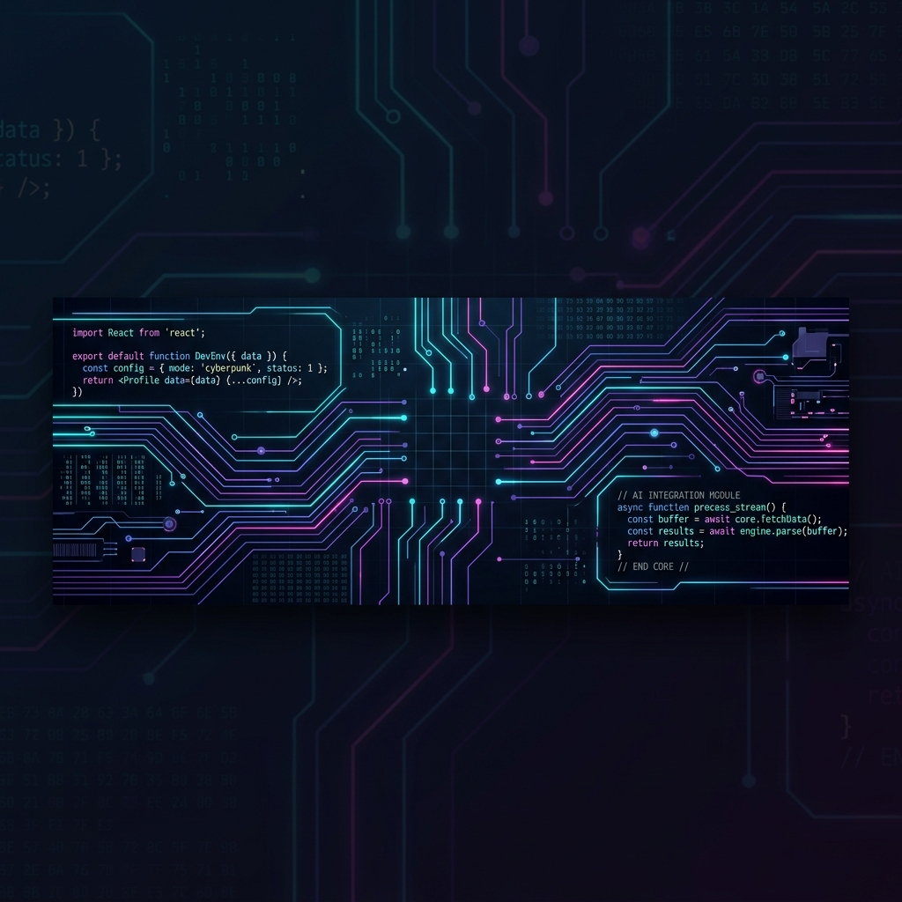

# ⚡ SYSTEM INITIALIZATION: SAKET_CHAWLA ⚡

<p align="center">
  
</p>

<p align="center">
  <a href="https://github.com/Saket-Chawla"></a>
  <a href="https://linkedin.com/in/wakeupsaket"></a>
  <a href="mailto:chawlasaket4271@gmail.com"></a>
</p>

```bash
$ cat profile.json
{
  "name": "Saket Chawla",
  "role": "Software Engineer & AI/ML Developer",
  "education": "BCA Graduate (DAV College, Amritsar)",
  "specialties": ["Machine Learning & NLP Pipelines", "Full-Stack Web Apps", "Data Analytics"],
  "mission": "Bridging the gap between intelligent ML models and scalable full-stack applications."
}
```

---

### 🛠️ CORE TECH STACK [DECODED]

#### 🤖 Machine Learning & NLP
<p align="left">
  
  
  
  
  
</p>

#### 🌐 Frontend & Web Engineering
<p align="left">
  
  
  
  
</p>

#### 📊 Data & Analytics Infrastructure
<p align="left">
  
  
  
  
</p>

#### 🚀 Cloud & DevOps Tools
<p align="left">
  
  
  
  
</p>

---

### 📊 SYSTEM DIAGNOSTICS & METRICS

<p align="center">
  
  
</p>

<p align="center">
  
</p>

---

### 🖥️ RECENT EXPERIMENTS (FEATURED PROJECTS)

| Repository | Tech Stack | Status | Description |
| :--- | :--- | :--- | :--- |
| [📂 Land-Graph](https://github.com/Saket-Chawla/Land-Graph) | Python • Pandas • Matplotlib | `[ACTIVE]` | Machine learning and EDA workspace for analyzing and visualizing geospatial/land data. |
| [📂 Trump-Catcher-Game](https://github.com/Saket-Chawla/Trump-Catcher-Game) | JavaScript • HTML5 • CSS3 | `[STABLE]` | An interactive, web-based catch game demonstrating dynamic DOM rendering and game loops. |
| [📂 Academic ML Work](https://github.com/Saket-Chawla) | Python • TensorFlow • NLP | `[WIP]` | Predictive modelling and behavioural analytics prototypes on academic datasets. |

---

### 📡 CONNECT WITH THE CORE
```bash
$ ping -c 3 saket.chawla
PING saket.chawla (127.0.0.1) 56(84) bytes of data.
64 bytes from linkedin.com/in/wakeupsaket: icmp_seq=1 ttl=64 time=0.42 ms
64 bytes from mailto:chawlasaket4271@gmail.com: icmp_seq=2 ttl=64 time=0.38 ms
64 bytes from github.com/Saket-Chawla: icmp_seq=3 ttl=64 time=0.45 ms

--- saket.chawla ping statistics ---
3 packets transmitted, 3 received, 0% packet loss, time 2004ms
rtt min/avg/max/mdev = 0.38/0.41/0.45/0.03 ms
```

<p align="center">
  <b>Let's build something intelligent and scalable. Get in touch!</b>
</p>
