<p align="center">
  
</p>

<p align="center">
  Hi, I'm <b>Saket Chawla</b>, a Software Engineer and AI/ML Developer based in India. I specialize in bridging the gap between intelligent machine learning models and scalable full-stack applications.
</p>

<p align="center">
  <a href="https://linkedin.com/in/wakeupsaket">LinkedIn</a> &bull; 
  <a href="mailto:chawlasaket4271@gmail.com">Email</a> &bull; 
  <a href="https://github.com/Saket-Chawla">GitHub</a>
</p>

---

### 🧠 Areas of Focus

* **Machine Learning & NLP** — Designing end-to-end ML pipelines, sentiment analysis, text classification, and conversational models.
* **Full-Stack Development** — Building high-performance APIs and reactive frontends using FastAPI, React, and Node.js.
* **Data Engineering & Analytics** — Performing EDA, data cleaning, and creating insightful dashboards with Pandas, NumPy, and Power BI.

---

### 🛠️ Technical Skillset

```
  Languages  :  Python  •  SQL  •  JavaScript (ES6+)
  AI & ML    :  PyTorch  •  TensorFlow  •  Scikit-Learn  •  FastAPI
  Frontend   :  React  •  HTML5  •  CSS3  •  Tailwind CSS
  Data Tech  :  Pandas  •  NumPy  •  Matplotlib  •  Power BI
  DevOps     :  Docker  •  AWS  •  GCP  •  Git  •  GitHub Actions
```

---

### 📂 Featured Projects

* 🚀 **[Land-Graph](https://github.com/Saket-Chawla/Land-Graph)** — ML and EDA workspace for analyzing and visualizing complex geospatial and land datasets.
* 🎮 **[Trump-Catcher-Game](https://github.com/Saket-Chawla/Trump-Catcher-Game)** — Interactive web game built using vanilla JavaScript showcasing DOM rendering, event handling, and clean code principles.
* 🤖 **Academic ML & NLP Models** — Prototypes for student performance forecasting and text semantic extraction using Python, TensorFlow, and custom NLP.

---

### 📈 GitHub Diagnostics

<p align="center">
  
  
</p>

<p align="center">
  
</p>
